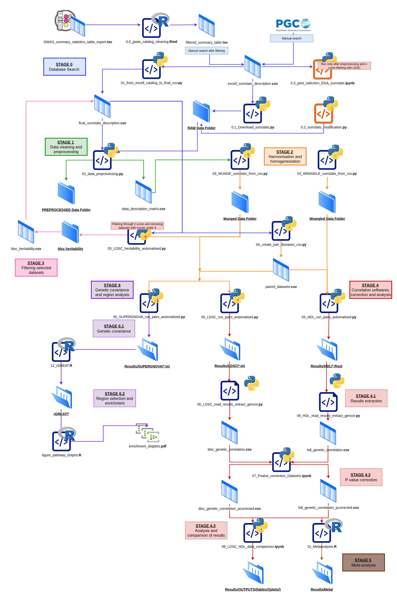

# A genetic-correlation pipeline for neuropsychiatric–cancer comorbidity.
This repository contains a reproducible workflow for identifying and characterising shared genetic architecture across psychiatric, neurological/neurodegenerative, and cancer phenotypes. The pipeline starts from publicly available GWAS summary statistics, harmonises heterogeneous datasets, estimates global and local genetic correlations, applies multiple-testing correction, compares complementary correlation methods, performs meta-analysis, and generates pathway-enrichment outputs.

This repository supports the study **“A Genetic Atlas of Direct and Inverse Neuropsychiatric–Cancer Comorbidity.”**
The interactive SOROLLA atlas is available at: **http://147.156.4.159:3838/sorollaatlas/**


## Overview

The workflow integrates GWAS summary statistics from the [GWAS Catalog](https://www.ebi.ac.uk/gwas/) and the [Psychiatric Genomics Consortium (PGC)](https://pgc.unc.edu/) and uses complementary methods to investigate both direct and inverse genetic comorbidity. The curation of datasets is semi-automated for GWAS Catalog and completely manual for PGC.

The main analyses include:

- GWAS dataset retrieval and metadata curation;
- summary-statistic quality control and preprocessing;
- harmonisation for LDSC, SUPERGNOVA and HDL;
- SNP-heritability estimation and dataset filtering;
- global genetic-correlation analysis with [LDSC](https://github.com/bulik/ldsc) and [HDL](https://github.com/zhenin/HDL);
- multiple-testing correction and cross-method comparison;
- meta-analysis of genetic-correlation estimates with [`metafor`](https://wviechtb.github.io/metafor/) and cluster-robust inference with [`clubSandwich`](https://jepusto.github.io/clubSandwich/);
- local genetic covariance analysis with [SUPERGNOVA](https://github.com/qlu-lab/SUPERGNOVA);
- region-based functional enrichment with [rGREAT](https://bioconductor.org/packages/rGREAT/) ([documentation](https://jokergoo.github.io/rGREAT/) and [development repository](https://github.com/jokergoo/rGREAT));
- generation of summary tables, plots, and pathway-enrichment figures.

---


## Workflow



### Stage 0 — Database search and dataset selection

GWAS datasets are collected from the GWAS Catalog and the PGC, followed by manual review and metadata curation.

- `SumStats/GWAS_summary_statistics_table_export.tsv` > Downloaded directly from GWASCatalog, used as input for 0.0_gwas_catalog_cleaning.Rmd
- `scripts/pipeline/0.0_gwas_catalog_cleaning.Rmd`> Output is filtered_summary_table.tsv
- `SumStats/filtered_summary_table.tsv`> Manual revision of datasets and annotation is saved as excell_sumstats_description.csv
- `SumStats/excell_sumstats_description.csv`> Annotated csv with all information regarding download URLs, study PMIDs, etc.
- `scripts/pipeline/0.1_Download_sumstats.py`> download all files from URL in excell_sumstats_description.csv
- `SumStats/RAW/` > Folder with raw downloaded data.
- `scripts/pipeline/01_from_excell_catalog_to_final_csv.py`> Takes excell_sumstats_description.csv and creates final_sumstats_description.csv
- `SumStats/final_sumstats_description.csv`> Final annotated dataset with paths and checkpoints of files inside the machines	
- `scripts/pipeline/0.2_sumstats_modification.py`> Small modifications done on either excell file or datasets before fixing.
- `scripts/pipeline/03_post_selection_EGA_sumstats.ipynb`> Data analysis performed (final results after z-score filtering)


### Stage 1 — Data cleaning and preprocessing

Raw summary statistics are standardised and quality-controlled before method-specific harmonisation. The preprocessing step resolves heterogeneous column names, checks allele and variant information, and reconstructs required fields when possible.

- `scripts/pipeline/02_data_preprocessing.py` — iterates through the datasets listed in `final_sumstats_description.csv`, reads each file using its dataset-specific metadata and column mappings, standardises the required fields, checks variant identifiers and allele information, reconstructs missing statistics when possible, and writes a preprocessed version of each dataset.
- `/SumStats/PREPROCESSED/` — contains the standardised datasets generated from the original files in `RAW/`. These files provide the common starting point for the LDSC-, HDL-, and SUPERGNOVA-specific formatting steps.
- `/SumStats/data_description_matrix.csv` — records the provenance of the main fields in every processed dataset. A value of `1` indicates that the field was present in the original summary statistics, `2` indicates that it was reconstructed from other available information, and `0` indicates that the field remained unavailable.


### Stage 2 — Method-specific harmonisation and dataset pairing
Preprocessed datasets are converted into the formats required by LDSC and HDL, standardising heterogeneous GWAS summary-statistic fields and applying consistent quality-control checks before downstream analysis.

- `scripts/pipeline/03_MUNGE_sumstats_from_csv.py` — custom automation wrapper for LDSC's `munge_sumstats.py`. It reads the dataset-specific column information from the metadata table, builds the appropriate LDSC command for each dataset, and generates LDSC-compatible munged summary statistics.
- `/SumStats/MUNGED/` — contains the outputs produced through LDSC's `munge_sumstats.py`. These files are used for LDSC heritability estimation and global genetic-correlation analysis, as well as for SUPERGNOVA.
- `scripts/pipeline/03_WRANGLE_sumstats_from_csv.py` — converts the preprocessed datasets into the method-specific format required by the HDL branch and records the corresponding output paths.
- `/SumStats/WRANGLED/` — contains the HDL-compatible summary-statistic files generated by `03_WRANGLE_sumstats_from_csv.py`.
- `04_create_pair_diseases_csv.py` — constructs the dataset combinations used in the pairwise analyses and links each pair to the appropriate method-specific input files.
- `/SumStats/paired_datasets.csv` — central pairwise-analysis manifest. Each row identifies a dataset pair and the file paths required to run LDSC, HDL, and, where applicable, SUPERGNOVA.

### Stage 3 — Heritability estimation and dataset filtering

SNP heritability is estimated with LDSC before genetic-correlation analyses are run.


- `scripts/pipeline/05_LDSC_heritability_automatised.py` — runs LDSC heritability estimation across the munged datasets and collects the relevant output statistics.
- `Results/ldsc_heritability/`— stores the individual LDSC heritability output files and logs.
- `Results/ldsc_heritability.csv` — consolidated table of SNP-heritability estimates, standard errors, and heritability z-scores used for dataset-level quality control.

Datasets with heritability z-scores below 4 are excluded from the downstream genetic-correlation analyses. After filtering, the retained dataset list and pairwise manifest should be checked and regenerated where necessary.


### Stage 4 — Global genetic-correlation analysis

Pairwise genetic correlations are estimated independently with LDSC and HDL. Running both methods provides complementary estimates and allows method agreement, sensitivity, and missingness to be evaluated directly.


#### LDSC branch

- `scripts/pipeline/05_LDSC_run_pairs_automatised.py` — reads the retained dataset pairs and runs LDSC cross-trait genetic-correlation analysis for each eligible pair.
- `Results/LDSC/*.txt` — raw LDSC output files and logs for the individual pairwise analyses.
- `scripts/pipeline/06_LDSC_read_results_extract_gencor.py` — parses the LDSC outputs and extracts the genetic-correlation estimate, standard error, test statistic, p-value, and relevant quality-control fields.
- `Results/ldsc_genetic_correlation.csv` — consolidated LDSC genetic-correlation results across all successfully analysed dataset pairs.

#### HDL branch

- `scripts/pipeline/05_HDL_run_pairs_automatised.py` — runs HDL genetic-correlation analysis for each eligible dataset pair using the HDL-specific input files and reference resources.
- `Results/HDL/*.Rout`— raw HDL output and log files generated for the individual pairwise analyses.
- `scripts/pipeline/06_HDL_read_results_extract_gencor.py`— parses the HDL outputs and extracts the pairwise genetic-correlation results into a common tabular format.
- `Results/hdl_genetic_correlation.csv`— consolidated HDL genetic-correlation results across all successfully analysed dataset pairs.

#### Multiple-testing correction and method comparison

- `scripts/pipeline/07_Pvalue_correction_Datasets.ipynb`— applies the project-wide multiple-testing correction to the LDSC and HDL results and assigns significance labels used in the downstream analyses.
- `Results/ldsc_genetic_correlation_pcorrected.csv`— LDSC results with corrected p-values and significance annotations.
- `Results/hdl_genetic_correlation_pcorrected.csv`— HDL results with corrected p-values and significance annotations.
- `scripts/pipeline/08_LDSC_HDL_data_comparison.ipynb`— compares the two methods, evaluates directional concordance and detection rates, calculates agreement metrics such as the Jaccard index, and produces the corresponding summary tables and figures.
- `Results/OUTPUTS/tables/` — publication and quality-control tables generated from the global correlation analyses.
- `Results/OUTPUTS/plots/`— heatmaps, agreement plots, Jaccard plots, and other graphical summaries generated from the global analyses.

These steps apply multiple-testing correction, quantify agreement between LDSC and HDL, and generate comparison tables and figures.

### Stage 5 — Meta-analysis

Genetic-correlation estimates representing the same disease pair are integrated through meta-analysis using the R package [`metafor`](https://wviechtb.github.io/metafor/). Cluster-robust variance estimation and small-sample corrections are implemented with [`clubSandwich`](https://jepusto.github.io/clubSandwich/) when required.


- `scripts/pipeline/10_Metaanalysis.R`— groups estimates by disease pair and fits the prespecified meta-analytic models using [`metafor`](https://wviechtb.github.io/metafor/). Cluster-robust variance estimation and small-sample corrections are implemented with [`clubSandwich`](https://jepusto.github.io/clubSandwich/) when the number and structure of available estimates permit.
- `Results/Meta/` — contains the meta-analytic estimates, model diagnostics, comparison tables, and figures generated from the integrated disease-pair results.

### Stage 6 — Local genetic covariance and region analysis

#### Stage 6.1 — Local genetic covariance
Local shared genetic architecture is evaluated with [SUPERGNOVA](https://github.com/qlu-lab/SUPERGNOVA), which estimates local genetic covariance and correlation from GWAS summary statistics and an LD reference panel.

- `scripts/pipeline/05_SUPERGNOVA_run_pairs_automatised.py` — runs SUPERGNOVA for the selected dataset pairs using the required summary statistics and LD reference resources.
- `Results/SUPERGNOVA/*.txt` — region-level SUPERGNOVA output files containing local covariance, local correlation, uncertainty estimates, and significance statistics.

SUPERGNOVA partitions genome-wide genetic covariance into approximately independent genomic regions. This makes it possible to identify loci that contribute disproportionately to a disease relationship, including local signals that may be missed when the genome-wide estimate is weak or when positive and negative regional effects partially cancel one another.


#### Stage 6.2 — Region selection and functional enrichment

Significant local-correlation regions are annotated and tested for functional enrichment with [rGREAT](https://bioconductor.org/packages/rGREAT/), an R/Bioconductor implementation of GREAT for genomic-region enrichment. Package documentation is available [here](https://jokergoo.github.io/rGREAT/), and the development repository is available on [GitHub](https://github.com/jokergoo/rGREAT).

Main scripts and outputs:

- `scripts/pipeline/12_rGREAT.R`— imports the selected significant regions, performs region-based annotation and enrichment with rGREAT, and exports the enriched terms and associated statistics.
- `Results/rGREAT/` — stores the region annotations, enrichment tables, and intermediate files generated by rGREAT.
- `scripts/pipeline/figure_pathway_dotplot.R` — converts the enrichment results into pathway-level dot plots used for interpretation and publication.
- `enrichment_dotplots.pdf` — combined pathway-enrichment figure output.

---

## Repository structure

```text
SOROLLA-gencor/
├── config/
│   ├── *.yaml
│   └── ldsc.def
├── Ref_Genomes/
│   ├── HapMap3/
│   └── eur_w_ld_chr/
├── SumStats/
│   ├── RAW/
│   ├── PREPROCESSED/
│   ├── Munged/
│   ├── Wrangled/
│   ├── excell_sumstats_description.csv
│   ├── final_sumstats_description.csv
│   └── paired_datasets.csv
├── Results/
│   ├── ldsc_genetic_correlation.csv
│   ├── hdl_genetic_correlation.csv
│   ├── LDSC/
│   ├── HDL/
│   ├── SUPERGNOVA/
│   ├── Meta/
|	|	├── 0_LDSC_meta_results.csv
|	|	├── 0_HDL_meta_results.csv
│   |   ├── LDSC/
|	|	|	├── main-minor
|	|	|	└── subtypes
│   |   └── HDL/
|	|		├── main-minor
|	|		└── subtypes
│   └── OUTPUTS/
│       ├── tables/
│       └── plots/
├── scripts/
│   └── pipeline/
├── Pipeline-v4.png
└── README.md
```

The exact directory contents may vary depending on which stages have already been executed. Output folders are generated during the workflow.

---

## Main metadata files

### `excell_sumstats_description.csv`

Manually curated metadata table containing the selected GWAS datasets and the information required for preprocessing and harmonisation. Depending on data availability, fields may include:

- publication title and PubMed identifier;
- GWAS Catalog or PGC accession;
- disease and dataset labels;
- ancestry and reference genome;
- download URL and source filename;
- SNP identifier;
- effect and non-effect alleles;
- effect-allele frequency;
- z-score, beta, odds ratio, standard error, and p-value fields;
- total sample size;
- case and control sample sizes;
- imputation INFO score;
- manually assigned exclusion or quality-control flags.

### `final_sumstats_description.csv`

Standardised dataset metadata generated from `excell_sumstats_description.csv` by:

```text
01_from_excell_catalog_to_final_csv.py
```

This file is used throughout preprocessing, harmonisation, heritability estimation, and downstream dataset selection.

### `paired_datasets.csv`

Generated by:

```text
04_create_pair_diseases_csv.py
```

This file contains the dataset pairs and method-specific file paths used for LDSC, HDL, and SUPERGNOVA analyses.

---

## Requirements

The workflow combines Python, R, Jupyter notebooks, and external genetic-correlation software. Required tools include:

- Python 3;
- R;
- Jupyter Notebook or JupyterLab;
- [LDSC](https://github.com/bulik/ldsc);
- [HDL](https://github.com/zhenin/HDL);
- [SUPERGNOVA](https://github.com/qlu-lab/SUPERGNOVA);
- [rGREAT](https://bioconductor.org/packages/rGREAT/) and its Bioconductor dependencies;
- [`metafor`](https://cran.r-project.org/package=metafor);
- [`clubSandwich`](https://cran.r-project.org/package=clubSandwich);
- method-specific linkage-disequilibrium reference panels;
- a Linux or compatible high-performance computing environment.

A local configuration file is used to define repository paths, software locations, reference-panel locations, and output directories. Update these paths before running the workflow.

The `config/` directory contains configuration files used to build or reproduce the LDSC environment, including the Singularity definition file where applicable.

---

## Reference data

Reference data required by LDSC include:

```text
Ref_Genomes/HapMap3/w_hm3.snplist
Ref_Genomes/eur_w_ld_chr/*
```

Additional method-specific reference files are required for HDL and SUPERGNOVA. These resources are not redistributed when their original licences or download conditions do not permit redistribution.

---

## Running the workflow

1. Clone the repository.
2. Download or install [LDSC](https://github.com/bulik/ldsc), [HDL](https://github.com/zhenin/HDL), [SUPERGNOVA](https://github.com/qlu-lab/SUPERGNOVA), [rGREAT](https://bioconductor.org/packages/rGREAT/), [`metafor`](https://cran.r-project.org/package=metafor), [`clubSandwich`](https://cran.r-project.org/package=clubSandwich), and the required reference panels.
3. Update the local configuration file with the correct repository, software, reference-data, and output paths.
4. Complete the dataset-selection metadata table.
5. Run the scripts in the numerical order shown in `Pipeline-v4.png`.
6. Inspect the outputs at the end of each stage before continuing.
7. Re-run dataset pairing after heritability-based filtering when required.
8. Perform global correlation, multiple-testing correction, meta-analysis, and local covariance analyses.

Because several steps depend on local software installations, computing infrastructure, and protected or manually curated metadata, users should inspect the configuration and script headers before execution.

---

## Main outputs

The pipeline produces:

- harmonised GWAS summary statistics;
- SNP-heritability estimates;
- filtered dataset metadata;
- pairwise LDSC genetic-correlation estimates;
- pairwise HDL genetic-correlation estimates;
- multiple-testing-corrected correlation tables;
- LDSC–HDL agreement and comparison results;
- meta-analysed genetic-correlation estimates;
- local genetic covariance results from SUPERGNOVA;
- rGREAT region-enrichment results;
- publication-ready summary tables and figures.

---

## Software, documentation, and key references

The workflow combines custom automation scripts with established open-source methods and R/Bioconductor packages. Users should cite both this repository/manuscript and the original software publications when reusing these methods.

### LDSC

- **Software:** [bulik/ldsc](https://github.com/bulik/ldsc)
- **Documentation:** [Heritability and genetic-correlation tutorial](https://github.com/bulik/ldsc/wiki/Heritability-and-Genetic-Correlation)
- **Method reference:** Bulik-Sullivan BK, et al. *LD Score regression distinguishes confounding from polygenicity in genome-wide association studies.* Nature Genetics. 2015;47:291–295. [https://doi.org/10.1038/ng.3211](https://doi.org/10.1038/ng.3211)
- **Cross-trait genetic-correlation reference:** Bulik-Sullivan B, et al. *An atlas of genetic correlations across human diseases and traits.* Nature Genetics. 2015;47:1236–1241. [https://doi.org/10.1038/ng.3406](https://doi.org/10.1038/ng.3406)

### HDL

- **Software:** [zhenin/HDL](https://github.com/zhenin/HDL)
- **Reference:** Ning Z, Pawitan Y, Shen X. *High-definition likelihood inference of genetic correlations across human complex traits.* Nature Genetics. 2020;52:859–864. [https://doi.org/10.1038/s41588-020-0653-y](https://doi.org/10.1038/s41588-020-0653-y)

### SUPERGNOVA

- **Software:** [qlu-lab/SUPERGNOVA](https://github.com/qlu-lab/SUPERGNOVA)
- **Reference:** Zhang Y, et al. *SUPERGNOVA: local genetic correlation analysis reveals heterogeneous etiologic sharing of complex traits.* Genome Biology. 2021;22:262. [https://doi.org/10.1186/s13059-021-02478-w](https://doi.org/10.1186/s13059-021-02478-w)

### rGREAT

- **Bioconductor package:** [rGREAT](https://bioconductor.org/packages/rGREAT/)
- **Documentation:** [jokergoo.github.io/rGREAT](https://jokergoo.github.io/rGREAT/)
- **Development repository:** [jokergoo/rGREAT](https://github.com/jokergoo/rGREAT)
- **Reference:** Gu Z, Hübschmann D. *rGREAT: an R/Bioconductor package for functional enrichment on genomic regions.* Bioinformatics. 2023;39:btac745. [https://doi.org/10.1093/bioinformatics/btac745](https://doi.org/10.1093/bioinformatics/btac745)

### metafor

- **CRAN package:** [metafor](https://cran.r-project.org/package=metafor)
- **Documentation and examples:** [metafor project website](https://wviechtb.github.io/metafor/)
- **Reference:** Viechtbauer W. *Conducting meta-analyses in R with the metafor package.* Journal of Statistical Software. 2010;36(3):1–48. [https://doi.org/10.18637/jss.v036.i03](https://doi.org/10.18637/jss.v036.i03)

### clubSandwich

- **CRAN package:** [clubSandwich](https://cran.r-project.org/package=clubSandwich)
- **Documentation:** [jepusto.github.io/clubSandwich](https://jepusto.github.io/clubSandwich/)
- **Meta-analysis vignette:** [Meta-analysis with cluster-robust variance estimation](https://cran.r-project.org/web/packages/clubSandwich/vignettes/meta-analysis-with-CRVE.html)
- **Method reference:** Pustejovsky JE, Tipton E. *Meta-analysis with robust variance estimation: expanding the range of working models.* Prevention Science. 2022;23:425–438. [https://doi.org/10.1007/s11121-021-01246-3](https://doi.org/10.1007/s11121-021-01246-3)


## Data sources

GWAS summary statistics are obtained from publicly accessible resources, including:

- [NHGRI-EBI GWAS Catalog](https://www.ebi.ac.uk/gwas/)
- [Psychiatric Genomics Consortium](https://pgc.unc.edu/)

Users are responsible for complying with the access conditions, licences, and citation requirements associated with each original dataset.

---

## Reproducibility notes

- Filenames shown in this README follow the current workflow and are reproduced exactly as used in the repository.
- Some steps include manual dataset review and phenotype classification; these decisions are recorded in the metadata tables.
- LDSC and HDL use different reference resources and may not return estimates for exactly the same set of dataset pairs.
- Heritability-based filtering should be completed before the final pairwise correlation analyses.
- Large GWAS files and external reference panels are generally not stored directly in the repository.

---

## Citation

The manuscript describing this workflow is currently under submission:

> Flores-Rodero M, Forés Martos J, Sánchez Ortí JV, Martínez S, Winkler F, Valencia A, Tabarés-Seisdedos R, Sánchez-Valle J. *A Genetic Atlas of Direct and Inverse Neuropsychiatric–Cancer Comorbidity.*

Please also cite the original publications and software repositories for LDSC, HDL, SUPERGNOVA, rGREAT, metafor, clubSandwich, MungeSumstats when applicable, and each GWAS dataset used in an analysis. Full software links and recommended references are listed above.

---

## Contact

For questions about the workflow, analyses, or repository, please contact:

- **Jon Sánchez-Valle** — `jon.sanchez@bsc.es`
- **Rafael Tabarés-Seisdedos** — `rafael.tabares@uv.es`

---

## Licence

Add the repository licence here. If no licence has yet been selected, note that the absence of a licence restricts reuse by default.